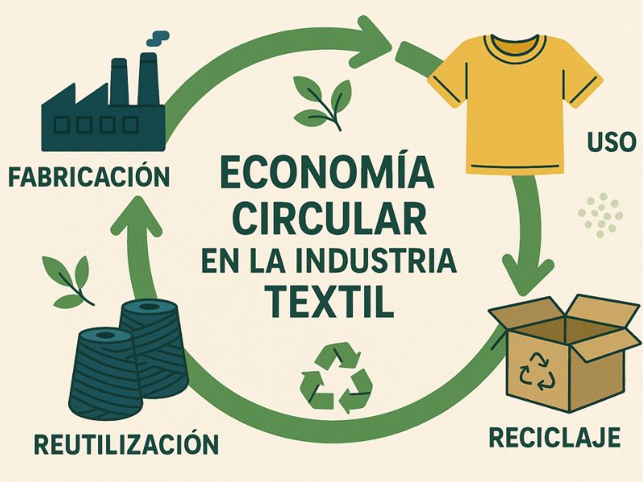
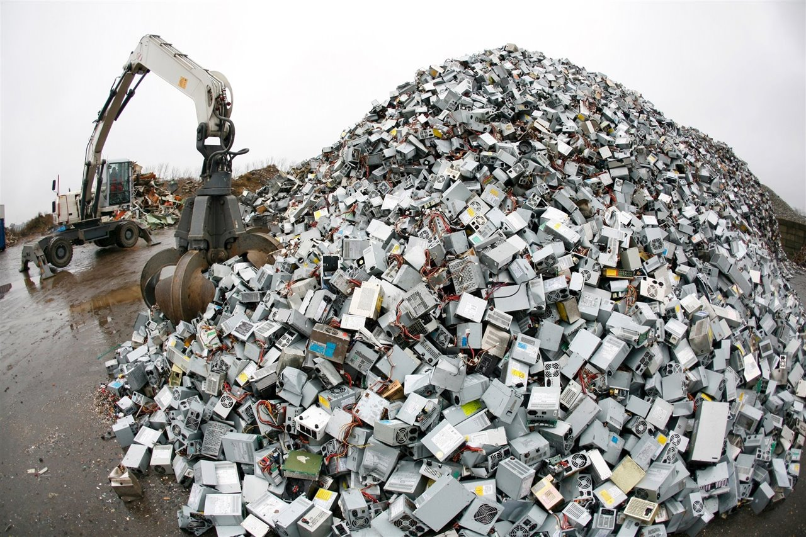

# Sostenibilidad
##
## Diciembre

### Semana 1 05/12/2025
No pude venir a clase, se habló lo siguiente:

La huella ecológica/carbono

### Pregunta
### ¿Cuál es tu huella de carbono?
Utilizando una herramienta para calcular la huella de carvono me ha dado como resultado 15.3t CO2e por año

### Opinión personal
No me suelo preocupar demasiado por la huella de carbono, pero es verdad que es un problema que se puede intentar solventar con medidas como el transporte publico, la reutilización de productos y el reciclaje

##
## Noviembre

### Semana 2 28/11/2025

### Resumen
Hemos hablado sobre la economia lineal y circular, la economia lineal es la que genera recursos y no los reutiliza, genera muchos residuos que el recicliaje no puede absorber, y puede provocar que se acaben los recursos, la economia circula es la que reutiliza los recursos y residuos que ya no sirven, se vasa en crear productos sostenibles y reutilizar recursos

### Pregunta
### ¿En que me afecta el ecodiseño? ¿Enfoque colectivo o individual?
Lo mas util es utilizar economia circular con un enfoque colectivo, asi se puede reutilizar los recursos para que se abarate la creación de productos, lo que nos afecta a nosotros ya que se abarata el propio producto

### Opinión personal
Creo que la economia circular es la manera mas practica de economia, ya sea por reutilizar recursos como por abaratar el mercado

### Semana 1 14/11/2025

### Resumen
 Hemos hablado sobre el ciclo de vida del producto y las etapas y recursos que son necesarios para crear cualquier producto

 ### Pregunta
 ### ¿Cual es el consumo de materiales necesario para conseguir 1Kg de litio?

 Una batería típica de un teléfono móvil contiene alrededor de 2 a 8 gramos de litio puro, para extraer 1kg se necesitan entre 1000 y 1500 KG de materiales

 ### Opinión personal
 Producir cualquier producto es costoso en terminos de materiales pero no se puede hacer gran cosa para abaratar la obtención de estos recursos ya que ya esta bastante optimizado, lo unico en lo que se puede pensar es en reutilizar los materiales de vertederos o productos viejos

##
## Octubre

### Semana 4 31/10/2025
Hemos hablado de la limitación de los recursos en el planeta, de las 3 dimensiones de la sociedad, social, económica y ambiental

### Semana 3 24/10/2025
Hemos hablado sobre los 2 tipos de estrategias que tienen las especies de reproducirse, la R (Tener muchos hijos) y la K (Tener menos hijos)

### Semana 2 17/10/2025
Hemos hablado sobre si vivimos solos o si tenemos que convivir con mas seres vivos y hemos hablado sobre las distintas maneras de relacionarse de las especies o los seres humanos

### Pregunta semana 2 17/10/2025
#### ¿Que hacemos nosotros: cooperamos o competimos?

Hacemos las 2 cosas, ya sea entre seres humanos o entre especies podemos cooperar para sobrevivir y competir por sobrevivir y por destacar ya sea como especie o como humanos.

### Semana 1 10/10/2025

Miguel explica los limites de población y recursos del planeta utilizando analogias como el moho.

### Pregunta semana 1 10/10/2025
 #### ¿Hay límite para la población humana?

Si, ya sea por falta de recursos o exceso de población, creo que el limite se puede expandir mucho pero siempre llegara el momento donde no se pueda.

##
## Septiembre

### Semana 1
 Miguel explica lo que vamos a hacer durante el curso y el trabajo que tenemos que entregar.

### Semana 2
 Miguel explica el tema 1 sobre la sostenibilidad.

### Semana 3
 Miguel explica las similitudes y diferencias entre los humanos y otros animales.

### Pregunta semana 3
 Creo que es muy dificil ya que hay especies mucho mas resistentes que los humanos y que pueden sobrevivir casi a cualquier problema como bacterias, virus o medusas.